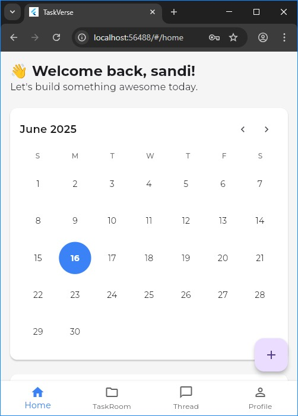
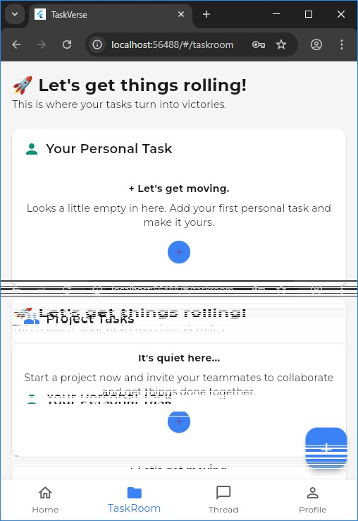
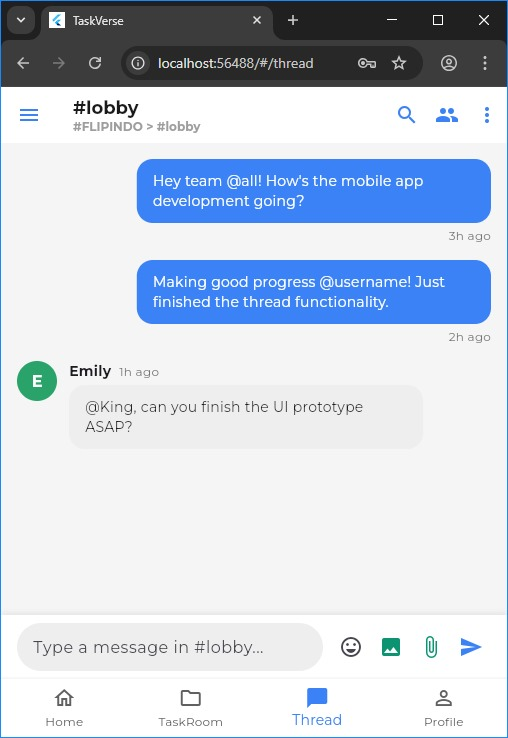

# TaskVerse v1.0

TaskVerse adalah aplikasi *modular collaborative productivity* berbasis Flutter. Aplikasi ini dirancang untuk membantu pengguna mengelola tugas pribadi dan proyek tim secara kolaboratif, lengkap dengan sistem komunikasi ala Slack/Discord.

## ✨ Fitur Utama

* ✅ Halaman Home dengan widget Reminder dan What's Going On
* ✅ Manajemen Personal Task (Deadline & Daily Activity)
* ✅ Manajemen Project Task dan integrasi Thread Project
* ✅ Thread Page (create thread & subthread HQ dan Project)
* ✅ Halaman Profil (ubah nama)
* ✅ Autentikasi Login & Register (via backend PHP sederhana)

## 📸 Cuplikan Antarmuka (Screenshots)

### Home Page

### TaskRoom

### Thread Page

## ⚙️ Teknologi yang Digunakan

* **Flutter (Dart)** — UI/UX
* **Provider** — State Management
* **PHP (Planned)** — Backend sederhana
* **Figma** — UI Wireframe

## 🚧 Status Pengembangan

* [x] UI utama selesai (Home, Task, Thread, Profile)
* [x] Fungsi utama Personal & Project Task
* [x] Sistem Thread & Chat
* [x] Dummy Logic Reminder & Notifikasi
* [ ] Backend penuh belum tersedia (hanya login/register)

## 👥 Kontributor

| Nama                 | NIM        | Peran/Modul                                                   |
| -------------------- | ---------- | ------------------------------------------------------------- |
| Muhammad Rizki Ilahi | 1303220094 | **Top Kontributor** - Backend logic, Integration major Backend between front end |
| Rahmat Fauzan        | 1303220170 | **Top Kontributor** - Home screen, UI/UX, Notifikasi logika,major front-end for this  |
| Ach Disya Milcky     | 1303220048 | UI/UX Design, Personal Task, Wireframe                        |
| Adrian Rifqi Ghifari | 1303220084 | Dokumentasi, Testing, Figma prototyping                       |
| Cholilur Rahman      | 1303220XXX | Review, Analisis Alur, Dokumentasi Teknis                     |

---

> Dibuat untuk memenuhi Tugas Besar Mata Kuliah **Aplikasi Perangkat Bergerak**.

---

**End of README**
